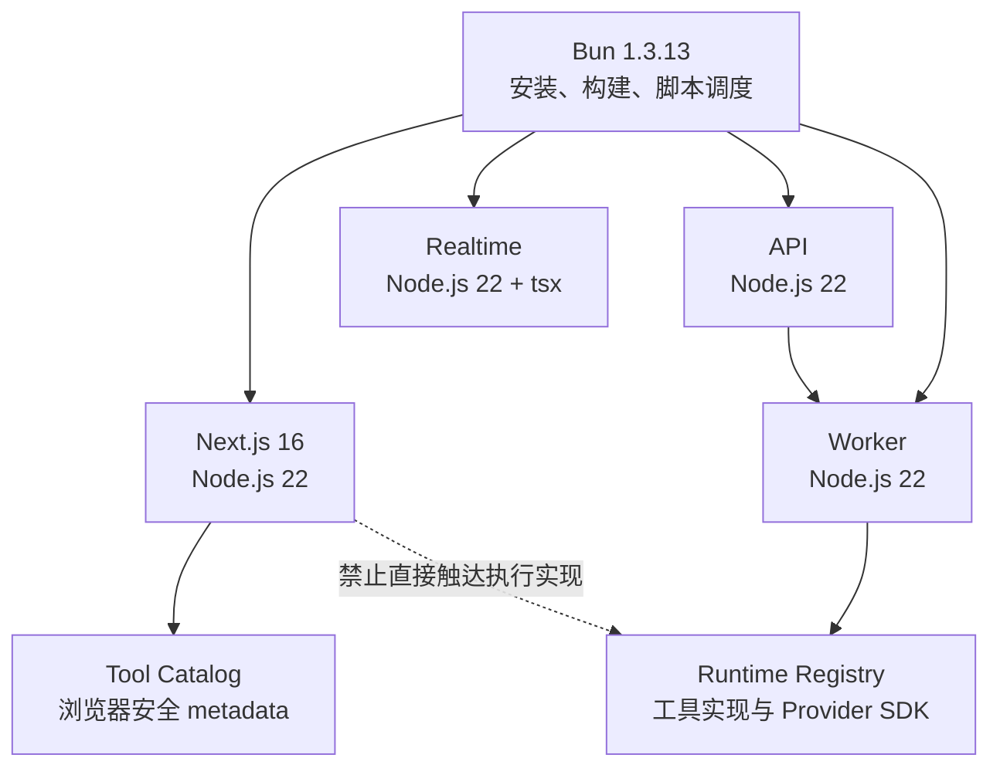

# Sim2 Node 22 启动与开发性能解决方案

## 1. 方案摘要

本专项不通过删除 Integration、使用精简注册表或立即替换 Next.js 来规避性能问题，而是采用
以下四层方案：

1. 统一 Next、Realtime、API、Worker 的应用运行时为 Node.js 22；
2. 将浏览器展示所需的轻量 metadata 与 Worker 执行所需的 Runtime Registry 分离；
3. 收窄 Workspace Home 和编辑器首屏依赖闭包，延迟加载非首屏能力；
4. 建立可重复的冷启动、热刷新、API、Next trace 和 RSS 性能验收旅程。

当前判断是：Next.js/Turbopack 会放大过大的模块依赖闭包，但不是约两分钟启动和刷新耗时的
唯一根因。首要工程问题是客户端展示代码间接触达 Runtime Registry、Executor、Sandbox、
Provider SDK、数据库、鉴权和服务端加密代码。

## 2. 问题与根因

### 2.1 主要问题

| 问题 | 影响 |
| --- | --- |
| Next 开发入口依赖 `next` shebang | 实际运行时不透明，无法证明使用 Node 22 |
| Realtime 使用 Bun 直接执行 TypeScript | 四服务运行时不一致，开发和生产行为存在偏差 |
| Realtime 与 API 默认端口均为 3002 | 服务启动冲突、代理等待或接口不可用 |
| 浏览器读取 metadata 时导入完整 Block Registry | Next 首次路由编译遍历大量运行时模块 |
| 纯 UI helper 与 Registry-backed helper 位于同一模块 | 轻量客户端组件被动引入完整依赖闭包 |
| Home 首屏同步构建完整模板候选池 | 首次可用时间被 Integration、模板和图标依赖阻塞 |
| 缺少固定提交、机器和缓存条件下的对照旅程 | 无法区分编译、接口、数据库和客户端渲染耗时 |

### 2.2 Next.js 的责任边界

Next.js/Turbopack 的按路由编译机制使污染链更容易表现为首次访问慢和内存占用高，但不应
把首次请求包含的编译时间直接归类为 API 或数据库耗时。

性能分析必须拆分为：

- Next 路由编译；
- 服务端接口处理；
- 数据库查询；
- 客户端加载和渲染。

只有清理依赖闭包后 Next 冷编译仍超过目标，才进入框架迁移评估。

## 3. 目标架构



核心边界如下：

```text
浏览器首屏
  -> @sim/tool-catalog
  -> 名称、描述、图标名、权限和可见性

Worker 执行侧
  -> Runtime Registry
  -> Executor、Sandbox、Provider SDK 和工具实现
```

## 4. 实施方案

### 4.1 统一 Node 22 启动链路

- 根目录、Next、Realtime、API、Worker 声明 Node.js `>=22.19.0`；
- Next 通过显式 Node 启动器加载 Next CLI；
- Realtime 开发模式使用 Node + `tsx`；
- Realtime 构建为 Node 目标产物，生产环境执行 `node dist/bootstrap.js`；
- API、Worker 保持 Node 启动，并统一预加载版本检查；
- 所有服务启动时输出服务名、Node 版本和 `process.execPath`；
- Realtime Docker Runner 使用 Node 22，Bun 只保留在构建阶段。

开发端口约定：

| 服务 | 默认端口 |
| --- | ---: |
| Next | 3000 |
| Realtime | 3002 |
| API | 3012 |
| Worker | 3013 |

### 4.2 收窄浏览器依赖闭包

已完成的关键调整：

- 权限判断从完整 Block Registry 迁移到 Tool Catalog 浏览器摘要；
- Workspace Home 的 Integration 图标通过 Catalog 解析，并按实际渲染动态加载图标模块；
- 将纯 tile 颜色 helper 从 Registry-backed 图标 helper 中拆出；
- 将相关 UI 消费者改为直接导入纯浏览器叶子模块；
- Home 首屏使用轻量静态 Suggested Actions；
- 个性化候选池和 OAuth 弹窗在数据就绪或用户操作后按需加载。

以上修改不改变：

- 产品 HTTP API；
- Tool、Block、Trigger ID；
- Integration 功能集合；
- 历史工作流存储格式。

### 4.3 保留完整功能

`dev:minimal` 仅用于判断完整 Registry 对编译和 RSS 的影响，不作为日常开发或最终交付
模式。webpack 同样只作为 Next/Turbopack 归因对照，不替代默认 Turbopack。

最终回归必须在完整注册表下覆盖：

- 登录；
- Workspace Home；
- Workflow Editor；
- 工具搜索；
- 代表性工作流执行。

## 5. 性能采集与验收

### 5.1 准备固定浏览器会话

账号和密码仅通过环境变量提供：

```powershell
$env:PERF_EMAIL = 'perf-user@example.test'
$env:PERF_PASSWORD = '<local-only>'
$env:PERF_WORKSPACE_ID = '<fixed-workspace-id>'
$env:PERF_WORKFLOW_ID = '<fixed-workflow-id>'

bun run perf:dev:prepare
```

浏览器会话、日志和临时缓存写入被 Git 忽略的 `.perf/`。

### 5.2 执行受控旅程

```powershell
bun run perf:dev:check
```

默认在相同源码、机器和环境下比较：

- 完整 Turbopack；
- minimal Registry；
- webpack 诊断模式。

每种模式执行三轮独立冷启动，每轮使用隔离的 Next 开发缓存，并采集：

- `/api/health` 就绪时间；
- Workspace Home 和 Workflow Editor 首次可用时间；
- 每个页面 10 次热刷新；
- 页面首屏 API waterfall 和状态码；
- 关键接口每路径 30 次稳态采样；
- Next compile trace；
- 进程 RSS 和内存阈值重启；
- 四服务 Node Runtime 证明；
- 源提交、Node/Bun/Next 版本、机器配置和安全环境摘要。

### 5.3 硬性门槛

| 指标 | 门槛 |
| --- | ---: |
| 服务就绪中位数 | `<= 30s` |
| Home 首次可用中位数 | `<= 10s` |
| Editor 首次可用中位数 | `<= 10s` |
| 单轮首次可用时间 | `<= 15s` |
| 10 次热刷新 P95 | `<= 2s` |
| 编译完成后关键 API P95 | `<= 1s` |
| 稳定开发 RSS | `<= 4GiB` |

时间 SLA 由受控 Node 22 沙箱验收；CI 只硬性阻断确定性的边界、体积、类型和测试回归。

## 6. 后续决策规则

1. 完整模式明显慢于 minimal：继续排查 Browser 到 Runtime Registry 的最短污染链；
2. 路由编译完成后 API P95 仍超过 1 秒：对最慢接口做独立直连采样；
3. 确认数据库为瓶颈：提交 `EXPLAIN (ANALYZE, BUFFERS)`、优化前后数据和回归测试；
4. 依赖闭包清理后 Next 冷编译仍超过 10 秒：单独形成 Vite 或其他框架迁移建议；
5. 不在本专项同时进行框架重写，避免运行时、依赖边界和框架迁移问题相互混淆。

## 7. 当前状态

| 项目 | 状态 |
| --- | --- |
| Node 22 版本检查和显式入口 | 已完成 |
| 四服务开发拓扑和端口隔离 | 已完成 |
| Realtime Node 构建与 Docker Runner | 已完成 |
| 性能采集器和机器可读报告结构 | 已完成 |
| 首批确定性 Browser/Registry 污染链清理 | 已完成 |
| 浏览器边界、Catalog、Contract、Worker 和 Realtime 门禁 | 已通过 |
| 三轮固定账号受控 SLA | 待固定数据库、账号、workspace 和 workflow 后采集 |

当前不能声明秒级 SLA 已正式通过。机器可读证据保持
`awaiting-controlled-node22-capture`，直到受控环境完成三轮独立采集。

## 8. 相关文档

- [问题清单与根因报告](../reviews/node22-development-performance-root-cause.md)
- [Node 22、Next 与开发性能边界 ADR](./decisions/ADR-0005-node22-next-development-performance-boundary.md)
- [重构与运行手册](../handoffs/node22-development-performance-runbook.md)
- [机器可读性能证据](../testing/evidence/node22-development-performance.json)

