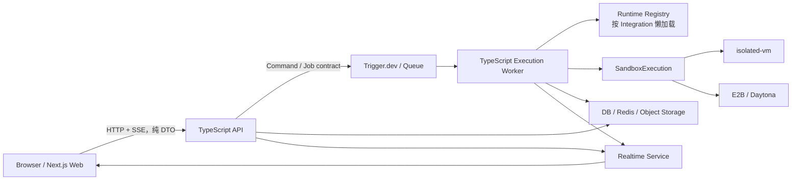
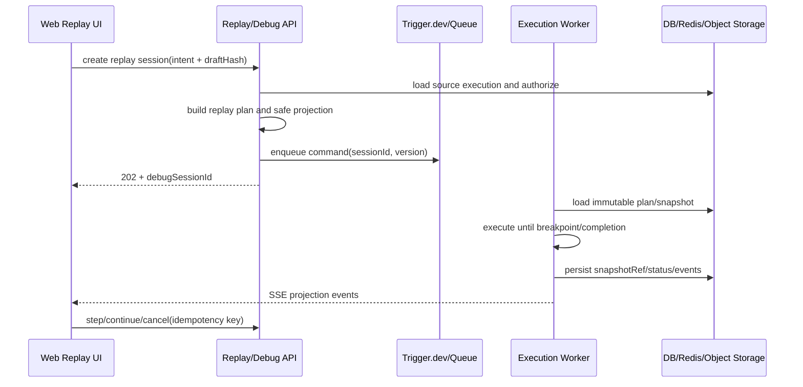

# Sim2 目标工程结构与 Polaris 迁移规划

> 状态：架构规划草案，供正式 Spec 输入
> 日期：2026-07-30
> 目标底座：`D:\workspace\workflow\sim2`
> 迁移来源：`D:\polaris`
> API 全量附录：[`api-migration-inventory.md`](./api-migration-inventory.md)

## 1. 目标结果

本次重构不是把 Polaris 整仓复制进 Sim2，也不是先用 Go 重写执行器。目标是：

1. 以 Sim2 的 Git 历史和产品能力为目标底座；
2. 第一阶段使用 TypeScript Web、TypeScript API、TypeScript Execution Worker；
3. 从第一天建立独立 API/Worker，但允许旧 Next.js Route 渐进迁移；
4. 完整覆盖现有 1,126 个唯一路径、1,377 个 HTTP handler；
5. 将 Polaris 的 PM、HR、Identity、Approval、Delivery、Operations 等业务能力迁入清晰的
   Biz Module；
6. 将 Meegle、Feishu、对象存储、Sandbox 等外部能力放入 Infra Extension；
7. 浏览器永远不导入 Runtime Registry、Executor、Provider SDK、DB、Auth 实现、加密实现
   或 Sandbox；
8. 保留 Sim2 全量 Integration 的服务端执行能力和历史工作流执行兼容；
9. 保留并增强 Polaris 画布 Replay/Debug，但将权威调试状态迁到 API/Worker。

## 2. 实施仓库策略

不要在 Polaris 工作树上继续堆叠后再整体复制，也不要合并两套无共同祖先的 Git 历史。

推荐从 Sim2 建立独立 worktree，例如：

```text
D:\workspace\workflow\sim2-refactor
```

迁移时以能力为单位从 Polaris 提取：

```text
Polaris 行为与测试
  -> 提取稳定 contract / domain rule / port
  -> 在 Sim2 refactor worktree 建立目标 module
  -> 通过 differential test 验证
  -> 灰度兼容 Route
```

Polaris 在迁移期是行为基准和 donor，不是新工程的目录模板。

## 3. 目标运行拓扑



核心规则：

- Web 只认识 API client、DTO、Tool Catalog 和浏览器安全的 workflow model；
- API 负责鉴权、授权、领域用例、查询、幂等、审计和任务 admission；
- Worker 负责 Executor、Runtime Registry、Provider SDK、Sandbox 与长任务；
- Composition Root 是唯一允许把 Biz port 与具体 Infra adapter 绑定的位置；
- Web/API/Worker 独立构建，禁止通过共享 barrel 重新形成一个编译闭包。

## 4. 目标工程目录

### 4.1 顶层目录

因为目标仓库需要长期合并 Sim2 `main`，最终也保留 `apps/sim` 名称，不再执行
`apps/sim -> apps/web` 的全目录重命名。相同路径越多，Git rename/conflict 噪音越小。

```text
sim2-refactor/
├─ apps/
│  ├─ sim/                         # Next.js + Turbopack Web；迁移期含兼容代理
│  ├─ api/                         # 独立 TypeScript HTTP API
│  ├─ worker/                      # 独立 TypeScript Execution Worker
│  ├─ realtime/                    # 现有协作与事件推送
│  ├─ desktop/                     # 保留 Sim2 Electron 客户端
│  ├─ docs/                        # 保留 Sim2/Fumadocs 文档站
│  ├─ pii/                         # 保留 Sim2 Python PII sidecar
│  └─ content-processor/           # 迁入 Polaris 文档/图片处理 sidecar
├─ packages/
│  ├─ api-contracts/               # 新增：HTTP schema、DTO、错误码、稳定 route ID
│  ├─ execution-contracts/         # 新增：Job、事件、Replay/Debug、Sandbox contract
│  ├─ tool-catalog/                # 新增：生成后的浏览器安全 metadata
│  ├─ polaris-extension-sdk/       # 新增：从真实扩展提取的最小生命周期
│  ├─ audit/                       # 保留 Sim2
│  ├─ auth/                        # 保留并收窄为共享 verifier
│  ├─ browser-protocol/            # 保留 Sim2 Desktop/Web 协议
│  ├─ cli/
│  ├─ db/
│  ├─ desktop-bridge/
│  ├─ emcn/
│  ├─ logger/
│  ├─ platform-authz/
│  ├─ python-sdk/
│  ├─ realtime-protocol/
│  ├─ runtime-secrets/
│  ├─ security/
│  ├─ terminal-protocol/
│  ├─ testing/
│  ├─ ts-sdk/
│  ├─ tsconfig/
│  ├─ utils/
│  ├─ workflow-persistence/
│  ├─ workflow-renderer/
│  └─ workflow-types/
├─ extensions/
│  ├─ biz/
│  │  ├─ identity/
│  │  ├─ pm/
│  │  ├─ hr/
│  │  ├─ approval/
│  │  ├─ delivery/
│  │  ├─ risk/
│  │  └─ operations/
│  └─ infra/
│     ├─ feishu-channel/
│     ├─ meegle-connector/
│     ├─ llm-providers/
│     ├─ object-storage/
│     ├─ vector-search/
│     ├─ code-host/
│     └─ sandbox/
├─ scripts/
│  ├─ architecture/                # import graph、bundle budget、边界检查
│  ├─ catalog/                     # Catalog 生成与一致性检查
│  ├─ migration/                   # API inventory、differential test
│  └─ upstream-sync/               # Sim2 main 变更影响报告
└─ docs/
   ├─ architecture/
   ├─ specs/
   ├─ migration/
   └─ handoffs/
```

Polaris 的 `apps/mothership` 与 `apps/operations-agent` 作为行为 donor，不直接成为最终应用：

- Mothership 的 chat/model/stream/resume/abort 行为迁入 API 的 Copilot Module 与 Worker job；
- Operations Agent 的任务、审批 gate、release/rollback/test 行为迁入 Operations Biz Module
  与 Worker；
- 在 differential test 完成前，原实现可作为测试对照进程，但不进入目标生产拓扑。

### 4.2 `apps/sim`：Web 与兼容层

```text
apps/sim/
├─ app/                            # 保留 Next App Router 页面结构，便于同步 upstream
│  ├─ (auth)/
│  ├─ (interfaces)/
│  ├─ (landing)/
│  ├─ account/
│  ├─ auth/
│  ├─ f/
│  ├─ hr/
│  ├─ invite/
│  ├─ organization/
│  ├─ playground/
│  ├─ review/
│  ├─ workspace/
│  └─ api/                         # 迁移期旧 Route；最终仅允许兼容代理/redirect
├─ features/
│  ├─ workflow-canvas/
│  ├─ replay-debug/
│  ├─ tool-catalog/
│  ├─ pm/
│  ├─ hr/
│  └─ administration/
├─ components/                     # 纯 UI 与页面组合
├─ hooks/
│  ├─ queries/                     # 只通过 api-contracts/request client
│  └─ selectors/
├─ stores/                         # 仅浏览器投影；禁止 Executor/ExecutionContext
├─ lib/
│  ├─ api-client/
│  ├─ browser/
│  ├─ navigation/
│  └─ presentation/
├─ content/
└─ public/
```

迁移完成后，`apps/sim` 不再包含：

- `executor/`；
- `tools/` 的运行时实现；
- `blocks/` 的执行实现；
- `triggers/` 的服务端实现；
- DB、Provider SDK、服务端 Auth/加密和 Sandbox；
- 业务逻辑型 Next Route。

这些当前目录不能一次删除；上游对齐表会标记其目标路径和同步方式。

### 4.3 `apps/api`：TypeScript 模块化单体

推荐 Fastify + Zod/OpenAPI；HTTP framework 只存在于 transport 层。

```text
apps/api/
├─ src/
│  ├─ server.ts
│  ├─ config/
│  ├─ transport/
│  │  ├─ http/
│  │  ├─ sse/
│  │  └─ compatibility/
│  ├─ middleware/
│  │  ├─ request-context/
│  │  ├─ authentication/
│  │  ├─ authorization/
│  │  ├─ idempotency/
│  │  ├─ rate-limit/
│  │  └─ error-mapping/
│  ├─ modules/
│  │  ├─ admin/
│  │  ├─ auth/
│  │  ├─ billing/
│  │  ├─ catalog/
│  │  ├─ copilot/
│  │  ├─ credentials/
│  │  ├─ files/
│  │  ├─ folders/
│  │  ├─ integrations/
│  │  ├─ invitations/
│  │  ├─ knowledge/
│  │  ├─ logs/
│  │  ├─ mcp/
│  │  ├─ organizations/
│  │  ├─ permissions/
│  │  ├─ public-v1/
│  │  ├─ schedules/
│  │  ├─ table/
│  │  ├─ users/
│  │  ├─ webhooks/
│  │  ├─ workflows/
│  │  ├─ workflow-execution-admission/
│  │  ├─ replay-debug/
│  │  └─ workspaces/
│  ├─ composition/
│  │  ├─ platform/
│  │  ├─ biz/
│  │  └─ infra/
│  └─ observability/
├─ tests/
│  ├─ contract/
│  ├─ differential/
│  ├─ integration/
│  └─ performance/
└─ package.json
```

PM、HR 等 Biz 实现不复制到 `apps/api/src/modules`。这里仅保存 HTTP transport 和
composition；真正业务规则位于 `extensions/biz`。

### 4.4 `apps/worker`：执行闭包

```text
apps/worker/
├─ src/
│  ├─ bootstrap/
│  ├─ jobs/
│  │  ├─ workflow-execution/
│  │  ├─ debug-session-command/
│  │  ├─ sandbox-execution/
│  │  ├─ integration-task/
│  │  ├─ content-processing/
│  │  └─ operations/
│  ├─ execution/
│  │  ├─ executor/
│  │  ├─ snapshots/
│  │  ├─ replay/
│  │  ├─ cancellation/
│  │  └─ events/
│  ├─ runtime/
│  │  ├─ registry/
│  │  ├─ loader/
│  │  ├─ blocks/
│  │  ├─ tools/
│  │  └─ triggers/
│  ├─ sandbox/
│  │  ├─ isolated-vm/
│  │  ├─ e2b/
│  │  └─ daytona/
│  ├─ composition/
│  └─ observability/
├─ tests/
│  ├─ execution/
│  ├─ replay-debug/
│  ├─ sandbox/
│  └─ integration-runtime/
└─ package.json
```

### 4.5 `extensions/biz`

每个 Biz Module 使用相同内部布局，公开入口只有 `src/index.ts`：

```text
extensions/biz/<module>/
├─ src/
│  ├─ domain/
│  ├─ application/
│  ├─ ports/
│  ├─ contracts/
│  ├─ repository/
│  └─ index.ts
├─ tests/
│  ├─ domain/
│  ├─ application/
│  └─ contract/
├─ package.json
└─ tsconfig.json
```

确定的 module 文件夹为：

```text
extensions/biz/
├─ identity/
├─ pm/
├─ hr/
├─ approval/
├─ delivery/
├─ risk/
└─ operations/
```

### 4.6 `extensions/infra`

```text
extensions/infra/
├─ feishu-channel/
│  └─ src/{auth,directory,messaging,approval,documents,webhooks,normalization,adapters}/
├─ meegle-connector/
│  └─ src/{auth,client,capabilities,hierarchy,normalization,errors,adapters}/
├─ llm-providers/
│  └─ src/{openai,anthropic,google,azure,bedrock,adapters}/
├─ object-storage/
│  └─ src/{minio,signed-url,adapters}/
├─ vector-search/
│  └─ src/{providers,adapters}/
├─ code-host/
│  └─ src/{github,gitlab,adapters}/
└─ sandbox/
   └─ src/{isolated-vm,e2b,daytona,adapters}/
```

每个 Infra Extension 自带：

```text
tests/{contract,integration,recordings}/
package.json
tsconfig.json
```

### 4.7 `packages`

新增 package 的内部目录固定如下：

```text
packages/api-contracts/src/
├─ core/
├─ workflow/
├─ integrations/
├─ polaris/
│  ├─ identity/
│  ├─ pm/
│  ├─ hr/
│  ├─ approval/
│  ├─ delivery/
│  ├─ risk/
│  └─ operations/
├─ primitives/
└─ index.ts

packages/execution-contracts/src/
├─ jobs/
├─ events/
├─ replay-debug/
├─ sandbox/
└─ index.ts

packages/tool-catalog/src/
├─ generated/
├─ schemas/
├─ search/
├─ compatibility/
└─ index.ts

packages/polaris-extension-sdk/src/
├─ manifest/
├─ lifecycle/
├─ health/
├─ capability-registration/
└─ index.ts
```

现有 `workflow-types`、`workflow-persistence`、`workflow-renderer`、`auth`、`emcn` 等 package
继续原路径演进，不建立功能重复的新 package。

## 5. Biz 与 Infra 的归属

### 5.1 依赖方向

```text
Biz use case
  -> 依赖 capability port
  <- Infra adapter 实现 port
  <- Composition Root 完成绑定
```

禁止：

```text
Biz -> @sim/meegle-connector
Biz -> @sim/feishu-channel
Biz -> tools/*/server-runner
Biz -> integrations/*/client
```

现有代码已发现直接耦合文件：

| 当前目录 | 直接耦合 Infra/工具运行时的文件数 |
| --- | ---: |
| `lib/polaris/pm` | 5 |
| `lib/polaris/hr` | 5 |
| `lib/polaris/delivery` | 2 |
| `lib/polaris/identity` | 2 |
| `lib/polaris/channels` | 5 |

这些不是简单移动目录即可解决，迁移时必须先抽 port，再移动实现。

### 5.2 Biz Module

| Module | 业务所有权 | 对外 port 示例 |
| --- | --- | --- |
| Identity | Person、Org、ExternalIdentity、Role、MenuGrant、DataScope | Directory、Identity Provider |
| PM | Project、Membership、Stage、Document、Context、MAT、WorkflowBinding | Project System、Document、Notification |
| HR | Employee、OffboardingCase、Step、Artifact、Signature、HR Todo | Directory、Messaging、Document、Signature |
| Approval | Definition、Instance、Decision、WaitSubscription | Approval Delivery、Identity Lookup |
| Delivery | Assignment、Todo、NotificationPolicy、DeliveryReceipt | Messaging、Task Sink |
| Risk | Risk、RuleSet、Simulation、Risk Schedule | Notification、Project Read |
| Operations | Release、Schedule、SyncJob、OperationRun、Retry Policy | Queue、Clock、Connector Execution |

每个 Biz Module 内部采用深模块结构：

```text
extensions/biz/pm/src/
├─ domain/                         # 实体、值对象、状态机、纯规则
├─ application/                    # 用例；组织事务与 port
├─ ports/                          # PM 需要的能力接口
├─ contracts/                      # 仅 PM 的稳定输入/输出
├─ repository/                     # repository interface
└─ index.ts                        # 小而稳定的公开入口
```

Biz Module 不拥有 HTTP、数据库驱动、Provider SDK 或具体队列实现。

### 5.3 Meegle

Meegle 是 Infra Extension，不是 PM 子目录：

```text
extensions/infra/meegle-connector/
├─ src/
│  ├─ client/
│  ├─ auth/
│  ├─ capabilities/
│  ├─ hierarchy/
│  ├─ normalization/
│  ├─ errors/
│  └─ adapters/
│     ├─ pm-project-system.ts
│     └─ operations-connector.ts
└─ tests/
```

职责拆分：

- Meegle Infra：OAuth/device auth、transport、Provider ID、能力发现、分页、限流、重试和错误归一化；
- PM Biz：项目/MAT/Action 的业务语义、映射意图和允许的状态变化；
- Operations Biz：SyncJob、attempt、schedule、审计、重试和 replay；
- Composition Root：把 Meegle adapter 注入 PM/Operations port；
- `/api/.../pm/connectors/meegle/*` 作为兼容路径保留，但路径名称不决定内部依赖方向。

当前 `lib/polaris/delivery/meegle/sync-service.ts` 应拆成 Provider transport、PM mapping policy
和 Operations sync orchestration 三部分，不能整体搬入任一新目录。

### 5.4 Feishu

Feishu 保持一个 Infra Extension，对外提供细粒度 capability：

```text
extensions/infra/feishu-channel/src/
├─ auth/
├─ directory/
├─ messaging/
├─ approval/
├─ documents/
├─ webhooks/
├─ normalization/
└─ adapters/
```

HR 不再调用 `runFeishuServerTool`；PM/Delivery/Channels 不再获取具体 Feishu client。各 Biz
Module 只依赖自己需要的 Directory、Messaging、Approval 或 Document port。

`channels` 的收件箱、幂等、业务路由和等待订阅属于后端业务/平台能力；Feishu 签名验证、
事件格式归一化和消息发送属于 Infra。

### 5.5 Extension SDK

`packages/polaris-extension-sdk` 当前只有设计说明，不能先凭空设计一个巨型 SDK。迁移顺序：

1. 先完成一个真实的 Meegle 或 Feishu adapter；
2. 从其 Composition/生命周期重复中提取最小 `ExtensionManifest`、`ExtensionContext`、
   health 与 capability registration；
3. Provider-specific DTO、业务实体和运行时 registry 不进入 SDK；
4. SDK 只允许依赖纯 contracts，不允许依赖 Web、API、Worker 或具体 Biz。

## 6. 前端加载与编译边界

### 6.1 Tool Catalog 与 Runtime Registry 分离

```text
Integration source
  ├─ build-time extractor -> versioned JSON catalog
  └─ server runtime entry -> Worker lazy loader
```

Tool Catalog 只含：

- 稳定 `toolId/blockId/triggerId`；
- 名称、描述、图标引用、分类、能力标签；
- 浏览器需要的轻量参数 schema；
- 搜索索引字段和 catalog version。

不得包含：

- 执行函数、闭包或动态 import 到运行时实现的引用；
- Provider SDK、凭证解析、Auth、DB、加密；
- Sandbox handle、Executor type、server-only environment；
- 完整注册表对象或能反向定位全部 runtime module 的 barrel。

浏览器先加载页面 shell，再按分类、搜索词或当前 workflow 中实际使用的 ID 请求 Catalog
切片。历史 workflow 缺失 metadata 时，由 API 按稳定 ID 返回兼容投影，不让 Web 回退到
Runtime Registry。

### 6.2 强制 import 规则

| From | 允许依赖 | 禁止依赖 |
| --- | --- | --- |
| Web | contracts、catalog、UI、browser workflow model | API implementation、Worker、runtime、DB、SDK、Sandbox、server encryption |
| API | contracts、Biz、repository port、queue client | 浏览器 store、完整 Runtime Registry、Provider SDK 执行闭包 |
| Biz | domain/application/ports、纯 contracts | 具体 Infra、HTTP framework、Next、工具 server-runner |
| Infra | Provider SDK、Biz port、platform contract | Web feature/store |
| Worker | execution contracts、runtime、Infra、Sandbox | Web feature/store |

CI 同时检查直接和传递 import graph。仅添加 `server-only` 标记不足以通过验收。

### 6.3 性能验收门槛（推荐值，待确认）

架构硬门槛：

- 任意 Web client chunk 到 Runtime Registry、Executor、Sandbox、Provider SDK、DB 和
  server encryption 的传递依赖数必须为 `0`；
- 非编辑器页面不得静态依赖 Monaco、ReactFlow 或 workflow Executor；
- Catalog 首屏必须分页/按需加载，不允许下发全量 4,000+ 工具实现或完整 schema；
- Web、API、Worker 必须可以分别构建，Worker 失败不能触发页面重新编译。

建议首轮量化门槛：

| 指标 | 建议门槛 |
| --- | ---: |
| 普通页面增量 client JS（gzip，不含共享框架 runtime） | ≤ 300 KB |
| Catalog 首次响应（gzip） | ≤ 150 KB |
| 普通页面开发冷编译 | ≤ 10 s |
| 普通页面开发热更新 | ≤ 1 s |
| 编辑器开发冷编译 | ≤ 20 s |
| Web 开发进程稳定 RSS | ≤ 4 GB |

量化值需要在固定机器、固定数据集和固定命令上建立 baseline；硬门槛不因机器差异放宽。

### 6.4 Next、Webpack、Turbopack 与 Vite

当前仓库使用 Next `16.2.11`。默认 `dev` 和 `build` 脚本调用 `next dev`/`next build`，
因此使用 Next 16 默认的 Turbopack；仓库另有显式 `dev:webpack` 诊断脚本和一段 webpack
alias 兼容配置，但生产规则禁止把 `next build --webpack` 作为降级方案。因此当前 2 分钟
编译问题不是“默认仍在使用 Webpack”的直接证据，而是 Web import graph 把 Runtime
Registry、Executor 和 Provider SDK 拉进了当前页面构建闭包。

结论：

- 不能在保留 Next App Router 的同时，把内部 bundler 受支持地替换为 Vite；
- Vite 是独立构建工具，不是 Next 的可插拔 bundler；
- 若采用 Vite，实际项目是“从 Next 迁移到 Vite + React Router/其他 Web framework”，
  需要重写 117 个 page、19 个 layout、Next navigation/server usages 和部署模型；
- 更换 bundler 不会自动修复错误 import；同一依赖图进入 Vite 后仍会被转换和加载；
- 第一阶段保持 Next + Turbopack，只修复 seam、Catalog、API/Worker 和前端按需加载；
- 当 `apps/sim/app/api` 仅剩兼容代理且浏览器依赖图为零后，再用独立 Spec 评估是否迁移
  到 Vite。该评估不得与 1,126 Route 的后端迁移绑在同一次切换中。

如果后续确实迁移 Vite，推荐 React Router Framework Mode，而不是裸 `vite + BrowserRouter`：
它提供类型安全 route module、自动路由切分以及 SPA/SSR/静态渲染选择。该建议是后续候选，
不属于本阶段已确认技术栈。

## 7. API 全量覆盖与迁移优先级

### 7.1 完整性规则

正式 Spec 不复制 1,126 行造成双重维护，而是将
[`api-migration-inventory.md`](./api-migration-inventory.md) 作为规范性附录：

- 每个现有路径必须有稳定 `API-nnnn` ID；
- 每个 handler 必须标记来源、方法、目标 Module、Wave、Risk 和必测集合；
- Spec 完成条件以附录 `1,126 Route / 1,377 handler` 全部有归属为准；
- 新增控制接口另列 `NEW-*` ID，不得借新增接口遗漏旧兼容路径；
- 87 个共有已分叉 Route 必须逐条写明选择 Sim2、Polaris 或合并行为；
- 删除或合并旧路径必须有兼容窗口、调用量证据和显式 deprecation 决策。

### 7.2 优先级

| 优先级 | 现有 Wave | Route 数 | 目标 |
| --- | --- | ---: | --- |
| P0 | 非 Route 前置 | 0 | 独立构建、import guard、contract harness、API/Worker skeleton |
| P1 | W1 | 3 | health/environment 与切流探针 |
| P2 | W2 | 95 | 低风险只读查询，验证 auth/query seam |
| P3 | W3 | 263 | Core CRUD、文件、DB/Redis/Object Storage |
| P4 | W4 | 555 | 按 Provider 分组迁移 Tool Adapter，生成兼容 handler |
| P5 | W5 | 29 | Workflow authoring、definition、deployment |
| P6 | W6 | 11 | Executor、Job、Sandbox、暂停/恢复/取消、流 |
| P7 | W7 | 61 | Auth/OAuth/Webhook/Cron/公网边缘 |
| P8 | W8 | 109 | Polaris Biz；按下述依赖子波次实施 |

P4 的 555 条不是 555 次手工复制。每个 Provider 先建立：

```text
Provider runtime adapter
  + generated route manifest
  + credential policy
  + error mapping
  + recorded contract fixtures
```

然后生成兼容 handler，并对附录中的每个 `API-*` 执行 contract/auth smoke test。

### 7.3 Polaris Biz 子波次

W8 的 109 条当前由附录覆盖，按依赖再拆：

| 子波次 | 范围 | 当前 Route 数 | 说明 |
| --- | --- | ---: | --- |
| W8.1 | Identity/Access | 16 | 先提供 Person/Org/Role/DataScope 基础 |
| W8.2 | PM | 52 | Project、Context、MAT、Documents、Assignments、兼容 connector 路径 |
| W8.3 | Approval | 8 | 定义、实例、决策、等待订阅 |
| W8.4 | HR | 9 | Offboarding 业务；另有 3 条文件 Route 已在 W3 |
| W8.5 | Delivery/Operations/Risk/Event | 23 | Todo、Notification、SyncJob、Schedule、Risk |
| W8.6 | MAT chat | 1 | 在 PM/MAT contract 稳定后迁移 |

Meegle/Feishu Infra 的实现可在 W8 前准备，但只有 Composition Root 可将其绑定到 Biz。

## 8. 画布 Replay/Debug 迁移

### 8.1 当前事实与问题

已存在的关键兼容 Route：

| ID | Route | 现状 |
| --- | --- | --- |
| API-0983 | `GET /api/workflows/[id]/debug/runs/[executionId]` | Polaris-only 调试投影 |
| API-0984 | `GET /api/workflows/[id]/debug/runs` | Polaris-only 失败执行列表 |
| API-0991 | `POST /api/workflows/[id]/execute` | 已分叉；Replay/RunFromBlock/Breakpoint 入口 |
| API-0994 | `GET /api/workflows/[id]/executions/[executionId]/stream` | 已分叉；带 Redis 事件补发 |

当前优点：

- `lib/workflows/replay-debug/projection.ts` 已能兼容旧 `blockExecutions` 和新递归
  `traceSpans`；
- 投影包含深度、数组、对象和字符串限制，并做敏感字段清理；
- 支持从头/失败节点、历史输入、安全/真实模式、断点、单步和继续；
- stream replay buffer 已有直接 Route 测试。

当前必须修正：

- Replay UI 直接导入 `executeWorkflowWithFullLogging` 和 `@/executor/types`；
- 浏览器端 `utils/replay.ts` 重建 `SerializableExecutionState`；
- Zustand execution store 持有 `Executor` 与 `ExecutionContext`；
- `use-workflow-execution.ts` 在浏览器调用 `executor.continueExecution`，并循环最多 500 次；
- UI 根据画布 edge 和节点输出计算下一执行节点；
- Replay query 使用通用 logs contract，与专用 replay-debug contract 存在漂移；
- 以上依赖会让 Executor 及其运行时闭包继续进入浏览器编译图。

### 8.2 目标模型

浏览器只提交意图：

```ts
type CreateReplaySession = {
  sourceExecutionId: string
  start: { mode: 'beginning' } | { mode: 'failed'; blockId?: string }
  executionMode: 'safe' | 'live'
  inputOverride?: { sourceBlockExecutionId: string; targetBlockId: string }
  breakpoint?: { afterBlockId: string }
  canvas: { mode: 'current-draft'; expectedDraftHash: string }
}
```

服务端保存权威 `DebugSession`：

```ts
type DebugSession = {
  id: string
  workflowId: string
  workspaceId: string
  sourceExecutionId: string
  draftHash: string
  executionMode: 'safe' | 'live'
  status: 'queued' | 'running' | 'paused' | 'completed' | 'failed' | 'cancelled'
  snapshotRef?: string
  nextBlockIds: string[]
  lastEventCursor?: string
  version: number
  expiresAt: string
}
```

完整 snapshot、历史输出 override 和 Provider credential 只存在于 API/Worker/存储。Web store
只保留 `debugSessionId`、状态投影、当前高亮节点和 event cursor。

当前 Polaris 的兼容语义是“使用当前 draft 画布 + 历史执行数据”，目标默认保持该行为；
`expectedDraftHash` 防止调试过程中画布静默变化。精确历史 revision replay 可在未来有完整
revision snapshot 后新增，不作为本次迁移前提。

### 8.3 新控制接口

以下为新架构内部控制面，不替代旧路径的兼容责任：

| 新 ID | Method/Path | 用途 |
| --- | --- | --- |
| NEW-REPLAY-01 | `POST /api/workflows/:id/replay-sessions` | 校验并创建 Replay/Debug Session |
| NEW-REPLAY-02 | `GET /api/debug-sessions/:id` | 查询安全状态投影 |
| NEW-REPLAY-03 | `POST /api/debug-sessions/:id/step` | 单步；要求 session version/idempotency key |
| NEW-REPLAY-04 | `POST /api/debug-sessions/:id/continue` | 继续到断点或完成 |
| NEW-REPLAY-05 | `POST /api/debug-sessions/:id/cancel` | 幂等取消 |
| NEW-REPLAY-06 | `GET /api/debug-sessions/:id/events` | SSE 状态/节点事件；支持 cursor 补发 |

`API-0991` 在迁移期转为兼容 facade，普通执行与 Replay 意图分别委托 Execution Admission
和 Replay/Debug Module。`API-0983/0984` 保持原 wire contract，但内部改用服务端 projection。

### 8.4 调用链



### 8.5 迁移步骤

1. 冻结 API-0983、API-0984、API-0991、API-0994 的 wire contract 与当前行为；
2. 将 `projection.ts`、legacy log normalization 和 replay plan builder 移到后端深模块；
3. Worker 接管 source snapshot、output override、下一节点计算和 continue loop；
4. 新建 Debug Session repository、TTL、version、命令幂等和并发锁；
5. UI 改用专用 replay-debug contract 与 SSE，仅保存安全投影；
6. 从 Web 删除 `Executor`、`ExecutionContext`、`SerializableExecutionState` 依赖；
7. 旧 execute/stream Route 代理到新 Module，完成 differential test 后灰度切流；
8. 证明 client import graph 为零后删除浏览器端执行兼容代码。

### 8.6 Replay/Debug 测试矩阵

| 维度 | 必测行为 |
| --- | --- |
| 历史格式 | legacy `blockExecutions` 与递归 `traceSpans` golden fixtures |
| 起点 | 从头、失败节点、节点已删除、节点被禁用 |
| 输入 | 原 workflow input、历史 block input 注入、非法/超大输入 |
| 模式 | safe 不调用 Provider；live 明示确认并记录审计 |
| 控制 | breakpoint、step、continue、cancel、完成后重复命令 |
| 一致性 | draftHash 冲突、session version 冲突、并发 step |
| 可靠性 | Worker retry、队列重复投递、进程重启、snapshot 恢复、TTL 清理 |
| 流 | 断线重连、cursor 补发、乱序/重复事件、背压 |
| 安全 | 跨 workspace、敏感字段脱敏、凭证不进入 DTO/日志 |
| 兼容 | API-0983/0984/0991/0994 旧新实现 differential test |
| 前端边界 | Replay 页面 bundle 不包含 Executor、Runtime Registry、Provider SDK |

特别验收：

- `safe` 模式的 Provider 调用次数必须为 `0`；
- 同一个 `step/continue` idempotency key 只能推进一次；
- UI 刷新后可用 `debugSessionId` 恢复视图，不依赖内存中的 Executor；
- Stream Replay、Channel Event Replay 和画布 Execution Replay 分开建模与监控。

## 9. 每个迁移单元的完成定义

每个 API/Module 只有同时满足以下条件才算完成：

1. Contract、Auth、状态码、错误体、幂等和副作用已冻结；
2. 新实现只通过允许的依赖方向构建；
3. 附录中的 `API-*` 行已更新到明确目标 Module 与负责人；
4. contract/auth smoke、domain/integration、differential 测试通过；
5. import graph 和性能预算通过；
6. 具备独立 feature flag、观测指标和回滚路径；
7. 灰度期间无兼容差异，或差异有明确批准；
8. 旧实现删除前已有调用量证据与回滚演练。

## 10. 仍需确认的决策

1. 第 6.3 节量化性能门槛是否作为正式验收标准；
2. `apps/api` 是否采用推荐的 Fastify + Zod/OpenAPI；
3. 独立 API 第一阶段是否与 Web 同域反向代理，还是直接跨域部署；
4. live Replay 是否只允许特定角色，是否需要二次确认和额外审计保留期。
5. API/Worker 分离完成并通过性能验收后，是否另立项目将 Next Web 迁移到 Vite。
