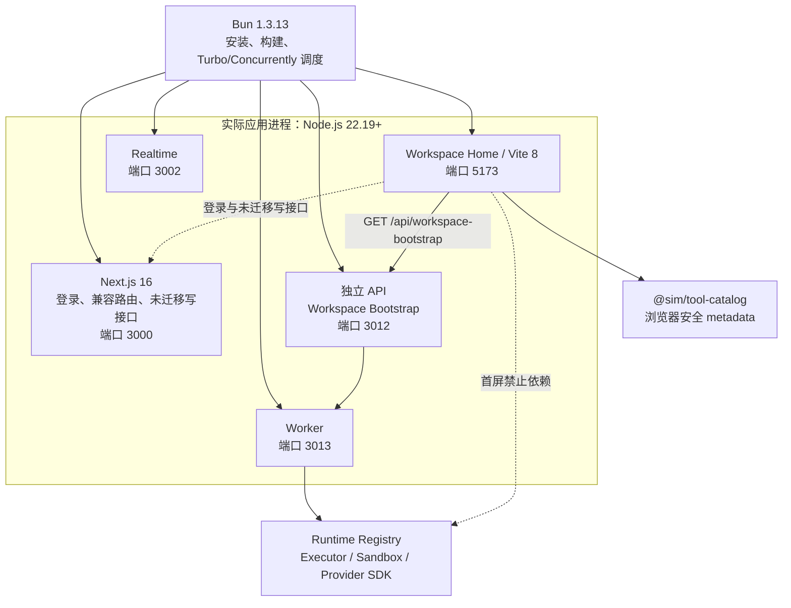

# Sim2 Node 22 与 Next.js 开发性能专项完整改造说明

## 1. 文档目的

本文档集中说明 `LaiosOvO/sim2` Node 22 与开发性能专项做了什么、为什么这样改、具体如何
实现、如何启动和验证，以及当前性能结果与后续重构边界。

本文档对应以下代码快照：

| 项目 | 值 |
| --- | --- |
| 基线分支 | `codex/frontend-backend-refactor` |
| 基线提交 | `acd7c56335a90f89edf7c8e8ec57d05f980a2aed` |
| 专项分支 | `agent/node22-next-performance` |
| 专项起点提交 | `bbaf79bc7d0030539fa2fe0112f40060699c07a7` |
| 草稿 PR | `LaiosOvO/sim2#1` |
| 改动规模 | 73 个文件，约 2354 行新增、410 行删除 |

## 2. 改造背景

项目原有开发环境存在以下现象：

- Next.js 前端启动、首次打开 Workspace 和刷新页面可能耗时约两分钟；
- 首次页面请求混合了 Next 路由编译、服务端处理、数据库查询和浏览器渲染，无法直接判断
  慢在哪里；
- Next、Realtime、API、Worker 的实际运行时不完全一致；
- 浏览器只需要工具名称、图标和可见性等展示数据，却可能间接导入完整 Block/Tool Runtime
  Registry；
- Runtime Registry 又连接 Executor、Sandbox、Provider SDK、数据库、鉴权和服务端加密逻辑，
  导致 Next 开发编译需要处理远超首屏需要的依赖图；
- 缺少固定账号、workspace、workflow、缓存状态和机器条件下的可重复性能证据。

本专项的目标不是删除功能或用 `dev:minimal` 代替完整开发模式，而是在保持所有 Integration、
Tool、Block、Trigger 和历史工作流兼容的前提下：

1. 统一应用进程到 Node.js 22；
2. 建立可信的性能采集基线；
3. 清理浏览器首屏到服务端执行实现的依赖污染链；
4. 判断约两分钟延迟究竟是否由 Next.js 引起；
5. 为是否继续保留 Next.js 或拆分独立前端构建提供证据。

## 3. 最终架构



这里需要区分“脚本调度器”和“应用运行时”：

- Bun 仍用于依赖安装、构建、Turbo、Concurrently 和辅助脚本调度；
- Next、Realtime、API、Worker 的实际服务进程全部由 Node.js 22 启动；
- 每个服务启动时输出运行时名称、Node 版本和 `process.execPath`，可以从日志直接证明运行时。

## 4. 主要根因结论

### 4.1 不是单纯的数据库或接口业务逻辑慢

受控准备阶段得到以下数据：

| 请求 | 总耗时 | 应用代码耗时 |
| --- | ---: | ---: |
| `/api/auth/get-session` | 24.8 秒 | 83 毫秒 |
| `/api/auth/sign-in/email` | 24.3 秒 | 437 毫秒 |
| `/workspace` | 32.8 秒 | 103 毫秒 |

应用处理保持在亚秒级，而总请求耗时达到 24～33 秒，差值主要来自 Next 首次路由和依赖编译。
因此，原始约两分钟现象不能直接归因于数据库查询或业务接口执行。

### 4.2 完整 Runtime Registry 会放大问题，但不是唯一根因

受控冷启动一分钟时：

| 模式 | Next RSS | V8 Heap Used | Home 状态 |
| --- | ---: | ---: | --- |
| 完整 Turbopack | 9,134 MiB | 113 MiB | 未达到可用状态 |
| Minimal Registry | 8,277 MiB | 244 MiB | 未达到可用状态 |

完整模式比 Minimal 模式多消耗约 0.85 GiB，说明 Runtime Registry 的确有成本；但两种模式
都超过 8 GiB，并且 Workspace Home 均未在 60 秒内完成。Registry 不是剩余问题的唯一解释。

### 4.3 当前主要瓶颈是 Next.js/Turbopack 原生编译状态

Next RSS 很高而 V8 Heap 较小，说明大部分内存不在普通 JavaScript 对象中，而位于
Next.js/Turbopack 原生编译、模块图和缓存状态。

结论是：

- Next.js 的按路由开发编译机制放大了过大的模块依赖闭包；
- 浏览器与 Runtime Registry 的耦合是需要修复的工程问题；
- 即使清理已确认的静态污染链，Next 16/Turbopack 仍未达到冷启动目标；
- 在原 Next 入口上不能宣称 Workspace Home 和 Workflow Editor 已达到秒级。

### 4.4 Workspace Home 的 60 秒来自多个 Next 冷路由编译叠加

在同一 Node 22.20、同一代码和缓存状态下逐个访问 Home 首屏接口，首次请求结果如下：

| 路由 | 状态 | 首次总耗时 |
| --- | ---: | ---: |
| `/api/auth/get-session` | 200 | 30,258 ms |
| `/api/workflows` | 401 | 13,012 ms |
| `/api/folders` | 401 | 13,042 ms |
| `/api/mothership/chats` | 401 | 7,006 ms |
| `/api/workspaces/:id/files` | 401 | 10,647 ms |

五个路由冷编译累计约 73,965 ms。日志中的应用代码处理仅为个位数到几十毫秒，证明
“完整页面约 60 秒”主要是多个 Next API 路由首次编译的瀑布，不是这五次数据库查询累计
耗时一分钟。

## 5. 具体改造内容

### 5.1 统一 Node.js 22 启动链路

#### 5.1.1 根目录运行时约束

根目录 `package.json` 新增：

```json
{
  "engines": {
    "bun": ">=1.3.13",
    "node": ">=22.19.0"
  }
}
```

新增 `scripts/runtime/assert-node-22.mjs`：

- 比较当前 `process.versions.node` 是否不低于 `22.19.0`；
- 版本过低时立即终止并输出明确错误；
- 版本正确时输出服务名、运行时、版本和实际 `execPath`；
- 避免“命令由 Bun 调度，所以误以为应用也由 Bun 运行”的情况。

#### 5.1.2 Next 显式 Node 入口

新增 `apps/sim/scripts/run-next.mjs`：

1. 通过 `require.resolve('next/dist/bin/next')` 定位真实 Next CLI；
2. 先执行 Node 22 版本检查；
3. 使用当前 `process.execPath` 加载 Next CLI；
4. 将 `dev`、`build`、`start`、`dev:minimal` 和 `dev:webpack` 都切换到该入口。

因此不再依赖 `next` 可执行文件 shebang 被哪个运行时解释。

#### 5.1.3 Realtime 改为 Node 开发与生产运行

Realtime 原来直接由 Bun 执行 TypeScript，现改为：

- 开发：`node --import assert-node-22.mjs --import tsx --watch src/index.ts`；
- 构建：Bun 将 `src/bootstrap.ts` 构建成 Node 目标的 `dist/bootstrap.js`；
- 生产：`node --import assert-node-22.mjs dist/bootstrap.js`；
- `engines.node` 收紧为 `>=22.19.0`；
- 新增 `tsx` 开发依赖。

`docker/realtime.Dockerfile` 改为两阶段运行：

- Builder 阶段仍使用 Bun 构建 Node 产物；
- Runner 阶段使用 `node:22.20.0-alpine`；
- 容器最终执行 `node apps/realtime/dist/bootstrap.js`，不再用 Bun 直接运行源码。

#### 5.1.4 API 与 Worker 增加统一版本检查

API、Worker 和 Worker Sandbox 的 `dev`、`start` 入口统一预加载
`assert-node-22.mjs`。原本就是 Node 进程的服务不改变业务启动逻辑，只增加运行时硬约束和
可审计日志。

#### 5.1.5 四服务端口隔离

原来 Realtime 和独立 API 都可能使用 3002，现调整为：

| 服务 | 默认端口 |
| --- | ---: |
| Next | 3000 |
| Realtime | 3002 |
| API | 3012 |
| Worker | 3013 |

Next 的 W1、W2、W6 API 代理默认地址同步改为 `http://127.0.0.1:3012`。

根目录 `dev:full`、`dev:full:minimal-registry`、`dev:full:webpack` 和 `dev:full:capped`
都同时启动 Next、Realtime、API、Worker，避免只启动 Web 和 Realtime 时得到不完整的性能
结论。

### 5.2 建立受控性能采集体系

新增三个主要命令：

```powershell
bun run perf:dev:seed
bun run perf:dev:prepare
bun run perf:dev:check
```

#### `perf:dev:seed`

- 从 `PERF_EMAIL` 和 `PERF_PASSWORD` 读取本地性能账号；
- 幂等创建或复用固定账号、workspace 和 workflow；
- 只把资源 ID 写入被 Git 忽略的 `.perf/journey/`；
- 密码不会写入磁盘或性能报告。

#### `perf:dev:prepare`

- 检查 `/api/health`；
- 使用 Playwright Chromium 完成真实登录；
- 验证固定 Workspace 可以访问；
- 将浏览器登录态保存到 `.perf/auth/storage-state.json`。

#### `perf:dev:check`

默认比较：

- 完整 Turbopack；
- Minimal Registry；
- webpack 诊断模式。

每种模式计划执行三轮独立冷启动，每轮：

1. 使用独立且空的 Next `distDir`；
2. 启动完整四服务拓扑；
3. 等待 `/api/health`；
4. 验证四个服务都输出 Node runtime proof；
5. 用真实浏览器测量 Home 和 Editor 首次可用；
6. 每个页面执行 10 次热刷新；
7. 记录页面 API waterfall 和状态码；
8. 对关键 API 直连采样 30 次；
9. 收集 Next compile trace、RSS 和内存重启信息；
10. 检查采集前后源码 SHA 是否发生变化。

采集器还增加了失败轮次持久化：

- 页面超时或服务失败时，报告记录 `status=failed` 和具体原因；
- 保留已经取得的日志、运行时证明和 trace；
- 不再因为第一轮失败而只留下“待采集”占位状态；
- 如果操作系统直接终止 runner，机器可读证据明确记录 runner termination。

#### 性能硬门槛

| 指标 | 验收门槛 |
| --- | ---: |
| 服务就绪中位数 | `<= 30 秒` |
| Home 首次可用中位数 | `<= 10 秒` |
| Editor 首次可用中位数 | `<= 10 秒` |
| Home/Editor 单轮最大值 | `<= 15 秒` |
| 10 次热刷新 P95 | `<= 2 秒` |
| 编译完成后关键 API P95 | `<= 1 秒` |
| Next 稳定 RSS | `<= 4 GiB` |
| 内存阈值重启 | `0` |

### 5.3 收窄浏览器首屏依赖闭包

#### 5.3.1 Catalog 与 Runtime Registry 分离

改造后的职责边界：

```text
浏览器展示层
  -> @sim/tool-catalog / Catalog Summary
  -> 名称、描述、图标名、权限、可见性

Worker 执行层
  -> Runtime Registry
  -> 工具实现、Executor、Sandbox、Provider SDK
```

具体修改：

- `lib/permission-groups/block-access.ts` 不再调用 `getBlock()` 读取完整 Block Registry，
  改为读取 Catalog Summary 的 `visibility.hideFromToolbar`；
- 新增 `lib/catalog/catalog-icon.tsx`，根据 Catalog 中的图标名按需加载图标模块；
- Workspace Home 的 integration chip 不再同步导入 `blocks/registry`；
- 不改变 Tool、Block、Trigger ID，也不删除任何 Integration。

#### 5.3.2 拆分纯浏览器颜色 Helper

原来的 `blocks/icon-color.ts` 同时包含：

- 只需要颜色字符串的纯 UI helper；
- 必须读取完整 Registry 的图标 helper。

即使页面只导入颜色函数，也可能把 Registry 带入客户端依赖图。

现在新增 `blocks/tile-icon-color.ts`：

- 只依赖轻量颜色判断；
- 提供 `isLightTileColor` 和 `getTileIconColorClass`；
- 多个编辑器、预览、集成和侧边栏组件改为直接导入该叶子模块；
- Registry-backed helper 继续保留在原模块，仅供确实需要 Registry 的位置使用。

#### 5.3.3 Home Suggested Actions 延迟加载

原来的 Home 首屏会同步完成：

- 遍历完整 Block metadata；
- 构造所有模板候选；
- 解析 OAuth Integration；
- 加载 OAuth Modal；
- 计算个性化加权建议。

现在拆分为：

- `suggested-actions.tsx`：只保留轻量的首屏静态建议和 UI；
- `suggested-actions-types.ts`：只包含浏览器安全类型；
- `suggested-actions-catalog.ts`：包含完整候选池和个性化计算；
- 数据就绪或用户点击 Shuffle 时再动态加载 Catalog 计算逻辑；
- 用户真正选择 Integration 时再加载 OAuth 解析和弹窗；
- OAuth 功能、建议算法和 Integration 集合保持完整。

#### 5.3.4 Home 非首屏能力延迟加载

- Workflow 导入逻辑改为用户执行导入时动态加载；
- `MothershipView` 仅在资源面板真正展开时渲染；
- 避免折叠状态下仍初始化重型资源预览依赖。

#### 5.3.5 Editor 侧边栏和导入逻辑延迟加载

- 搜索 Modal 未打开时不构建 Integration 和 Connected Account 搜索数据；
- 打开搜索框后再动态加载 Integration Search Items；
- Workflow 导入时再加载压缩包解析、导入持久化和 Workflow Diff Store；
- 将部分 barrel import 改为叶子路径，减少无关模块被静态遍历。

#### 5.3.6 Auth 临界路径减重

Auth 模块原来静态导入大量只有特定回调才需要的能力，包括：

- 邮件模板与邮件发送；
- 生命周期邮件；
- PostHog 服务端客户端；
- Billing Usage；
- Instance Organization；
- Credential Draft；
- Workflow 禁用逻辑。

现在：

- 邮件主题使用叶子模块直接导入；
- 邮件渲染、发送、PostHog、Billing、生命周期和凭据处理在对应回调真正触发时动态加载；
- Session 和普通登录请求不再为这些低频能力预编译整个依赖闭包；
- 业务回调行为保持不变。

### 5.4 Tailwind 从开发时全局扫描改为预生成

新增：

```powershell
bun run --cwd apps/sim css:build
bun run check:tailwind-generated
```

实现方式：

- Tailwind CLI 从 `globals.css` 生成压缩后的 `tailwind.generated.css`；
- 根 Layout 直接导入生成后的 CSS；
- PostCSS 开发链不再在每次 Next 路由编译时运行 Tailwind 全局扫描；
- `css:check` 重新生成 CSS 并通过 Git Diff 检查产物是否漂移；
- CI 增加确定性检查。

### 5.5 Next 缓存与诊断模式

`next.config.ts` 新增 `SIM_NEXT_DIST_DIR`：

- 性能采集时为每个模式使用隔离缓存；
- 每轮采集前清理并重新创建受控缓存目录；
- 固定使用 `.next-perf/current-<mode>`，避免历史缓存目录进入 Next 文件监听范围；
- webpack 模式补充 `@` 根路径 Alias，保证与 Turbopack 的路径解析一致。

`dev:minimal` 和 webpack 只用于根因对照：

- `dev:minimal` 不删除产品 Integration，但用精简 Registry Alias 判断 Registry 成本；
- webpack 用于判断问题是否特定于 Turbopack；
- 两者都不是最终日常开发方案，也不参与完整模式 SLA 通过判定。

### 5.6 修复全量 Sim 类型错误

`resume-page-client.tsx` 原有 6 个类型错误来自对未知 JSON 结构的直接属性访问。

修复方式：

- 新增 `asRecord()`，把 `unknown` 安全收窄为 `Record<string, unknown>`；
- 新增 Pause Response 和 Resume Values 的边界解析 helper；
- 对 `operation`、`inputFormat`、`responseStructure` 和 `submission` 分别做运行时类型判断；
- 将 `Record<string, any>` 收紧为 `Record<string, unknown>`；
- 允许日期字段为 `undefined`；
- 不改变 Resume 页面协议和历史数据格式。

修复后完整 `apps/sim` 的 `tsc --noEmit` 与 `tsgo --noEmit` 均通过。

## 6. 关键文件说明

| 文件 | 作用 |
| --- | --- |
| `scripts/runtime/assert-node-22.mjs` | Node 22.19+ 版本检查与运行时证明 |
| `apps/sim/scripts/run-next.mjs` | 用当前 Node 显式启动 Next CLI |
| `apps/realtime/package.json` | Realtime Node + tsx 开发及 Node 目标构建 |
| `docker/realtime.Dockerfile` | Bun Builder + Node 22 Runner |
| `scripts/architecture/runtime/check-node-entrypoints.mjs` | 验证四服务 Node 入口与版本 |
| `scripts/architecture/performance/seed-dev-journey.mjs` | 创建固定性能账号资源 |
| `scripts/architecture/performance/prepare-dev-journey.mjs` | Playwright 登录和会话准备 |
| `scripts/architecture/performance/check-dev-performance.mjs` | 三模式、三轮性能采集器 |
| `scripts/architecture/performance/performance-metrics.mjs` | P50/P95、RSS 和 SLA 判定 |
| `apps/sim/lib/catalog/catalog-icon.tsx` | 浏览器安全的 Catalog 图标解析 |
| `apps/sim/blocks/tile-icon-color.ts` | 不依赖 Registry 的纯 UI helper |
| `suggested-actions-catalog.ts` | 延迟加载的完整建议候选池 |
| `apps/sim/lib/auth/auth.ts` | Auth 低频依赖动态加载 |
| `apps/sim/app/_styles/tailwind.generated.css` | 预生成 Tailwind CSS |
| `docs/testing/evidence/node22-development-performance.json` | 机器可读性能证据 |

## 7. 启动与使用方式

### 7.1 环境要求

- Node.js `22.19.0` 或更高的 Node 22 版本；
- Bun `1.3.13` 或更高兼容版本；
- PostgreSQL、Redis 和项目所需环境变量；
- 性能旅程需要 Playwright Chromium。

检查版本：

```powershell
node --version
bun --version
```

### 7.2 启动完整开发环境

```powershell
bun install --frozen-lockfile
bun run dev:full
```

日志中应出现类似内容：

```text
[runtime] service=next runtime=node version=22.20.0 execPath=...
[runtime] service=realtime runtime=node version=22.20.0 execPath=...
[runtime] service=api runtime=node version=22.20.0 execPath=...
[runtime] service=worker runtime=node version=22.20.0 execPath=...
```

### 7.3 执行受控性能旅程

账号密码只通过环境变量提供：

```powershell
$env:PERF_EMAIL = 'perf-user@example.test'
$env:PERF_PASSWORD = '<local-only>'

bun run perf:dev:seed
bun run perf:dev:prepare
```

停止手工启动的服务后执行：

```powershell
bun run perf:dev:check
```

可用环境变量：

| 变量 | 默认值 | 用途 |
| --- | --- | --- |
| `PERF_BASE_URL` | `http://127.0.0.1:3000` | Next 地址 |
| `PERF_MODES` | `full,minimal,webpack` | 采集模式 |
| `PERF_ROUNDS` | `3` | 每种模式冷启动轮数 |
| `PERF_WARM_RELOADS` | `10` | 每页面每轮热刷新次数 |
| `PERF_API_SAMPLES` | `30` | 每个关键 API 采样数 |
| `PERF_API_PATHS` | 自动选择 | 指定关键 API |
| `PERF_EVIDENCE_PATH` | `.perf/reports/...json` | 报告路径 |

## 8. 验证方式

主要确定性门禁：

```powershell
bun run check:node-runtime-entrypoints
bun run check:tailwind-generated
bun run check:browser-runtime-closure
bun run check:lightweight-client-surfaces
bun run check:catalog-browser-build
bun run check:catalog-consumers
bun run check:contract-browser-build
bun run check:runtime-catalog
bun run check:runtime-registry-boundary
bun run check:runtime-registry-lazy-build
bun run check:worker-role-isolation
bun run check:realtime-prune
bunx vitest run scripts/architecture/performance/performance-metrics.test.ts
```

类型检查：

```powershell
bunx tsc --noEmit -p apps/sim/tsconfig.json
bunx tsgo --noEmit -p apps/sim/tsconfig.json
bun run --cwd apps/realtime type-check
```

本专项已验证：

- Node 22 四服务入口检查通过；
- 完整 Sim `tsc --noEmit` 与 `tsgo --noEmit` 通过；
- Auth Route 和性能指标 Vitest 通过；
- Browser Runtime Closure 与 Lightweight Client Surface 门禁通过；
- Catalog、Contract、Runtime Registry、Worker Isolation 门禁通过；
- Realtime prune、类型检查和 Node 构建通过；
- Tailwind 生成产物检查通过；
- Biome 与 `git diff --check` 通过。

## 9. 当前性能结果

### Workspace Home 已达到秒级

最终采用“Next 保留兼容面，Workspace Home 使用独立 Vite 构建”的方案。受控真实链路使用
Node 22.20、固定本地账号、`simstudio_perf` 数据库、真实 session cookie、真实 workspace
和真实独立 API，结果如下：

| 指标 | 结果 | 本阶段门槛 |
| --- | ---: | ---: |
| Vite 服务就绪 | 570 ms | 2,000 ms |
| Home 完整数据冷可用 | 678 ms | 1,000 ms |
| 10 次热刷新 P95 | 112 ms | 500 ms |
| Bootstrap API 30 次 P95 | 17 ms | 1,000 ms |
| Bootstrap API 状态 | 30/30 为 200 | 全部 2xx |
| Vite 生产构建 | 258 ms | 通过 |
| 浏览器 JS gzip | 63.28 KiB | 轻量入口 |

这里的“完整数据冷可用”不是只测静态壳层：浏览器加载真实登录态，并等待
`data-workspace-data-state="complete"`，即 session、Workflows、Folders、Chats 和 Files
已经由独立 API 返回并完成 React 渲染。

### 尚未宣称通过的范围

- Workflow Editor 仍运行在 Next，尚未迁移到 Vite；
- 原 Home 中的 Browser/Terminal 资源面板、文件上传、语音输入、富 Tool Call 卡片等高级交互
  尚未全部迁入新的轻量 Home；当前通过的是核心聊天、历史会话、Workflow 导航和首屏数据；
- Next 原完整模式的 Editor 冷启动和 RSS 门槛仍未通过；
- `dev:full:vite` 是性能专项入口；默认 `dev:full` 仍保留原 Next 完整功能；
- 本阶段不把轻量 Home 的性能通过结果冒充原 Home 100% 功能等价或 Editor 验收。

## 10. 停止零散 Next 优化后的落地决策

Next 受控对照满足停止条件：冷路由远超 10 秒，完整模式 RSS 超过 4 GiB，webpack 也无法
在 120 秒浏览器超时内完成 Home 首次编译。因此没有继续零散调整 Next 配置，而是实施：

```text
Next 3000
  保留登录、SSR/兼容页面和未迁移写接口

Workspace Vite 5173
  独立 React 入口，不导入 apps/sim、Next 或任何 @sim 服务端包

Node API 3012
  GET /api/workspace-bootstrap
  一次鉴权、一次 workspace 授权、四组数据库查询并行执行
```

Next 在 `SIM_WORKSPACE_VITE_URL` 存在时把 Workspace Home 重定向到 Vite。Vite 对
`/api/workspace-bootstrap` 单独代理到 Node API，其余尚未迁移的 `/api` 继续代理到 Next，
所以本阶段不改变既有产品写接口、Tool/Block/Trigger ID 或历史 Workflow 格式。

新增门禁确保 Vite 源码不能导入 `next`、`@/`、`@sim/*`、Node 内置模块或逃逸到
`apps/sim`。CI 同时执行边界检查、独立类型检查和 Vite 生产构建。

开发与验证命令：

```powershell
bun run dev:full:vite
bun run check:workspace-vite
bun run perf:workspace:vite
```

真实后端验收还需要先完成 `perf:dev:seed`，并在 Next 与独立 API 已启动时执行：

```powershell
$env:PERF_WORKSPACE_REAL_BACKEND = '1'
$env:PERF_WORKSPACE_ID = '<controlled-workspace-id>'
bun run perf:workspace:vite
```

无论选择哪种方案，都必须保持：

- 产品 HTTP API 不变；
- Tool、Block、Trigger ID 不变；
- Integration 功能集合不变；
- 历史 Workflow JSON 格式不变；
- Runtime Registry 仍只在 Worker 执行侧加载。

## 11. 提交阶段

| 提交 | 内容 |
| --- | --- |
| `f572ac4f` | 新增受控启动与浏览器性能旅程 |
| `7f42f1a7` | 四服务统一 Node 22 运行时 |
| `b274ae18` | 收窄首批客户端依赖闭包 |
| `f4c9a7d4` | 记录 Node 22 与 Next 性能 ADR |
| `2e8c4dd7` | 汇总开发性能解决方案 |
| `0d0eaf7b` | 修复 Resume 页面 6 个类型错误 |
| `c7f7ad4d` | 修复 Node 22 SLA 采集可重复性 |
| `8675dd57` | 延迟可选依赖并预生成 Tailwind |
| `2bbba150` | 回收隔离的 Next 性能缓存 |
| `2336b18d` | 延迟 Auth 非临界依赖 |
| `cdb9cfad` | 持久化失败的 SLA 轮次 |
| `bbaf79bc` | 记录受控 Node 22 SLA 失败证据 |

## 12. 相关文档

- [开发性能解决方案](../architecture/node22-development-performance-solution.md)
- [问题清单与根因报告](../reviews/node22-development-performance-root-cause.md)
- [Node 22 与 Next 性能边界 ADR](../architecture/decisions/ADR-0005-node22-next-development-performance-boundary.md)
- [性能重构运行手册](./node22-development-performance-runbook.md)
- [机器可读性能证据](../testing/evidence/node22-development-performance.json)
- [平台分离与迁移 Spec](../specs/sim2-platform-separation-and-polaris-migration.md)
